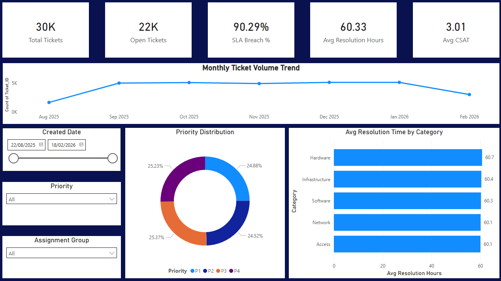

# 🚀 IT Operations Analytics Dashboard

## 📌 Overview

This project demonstrates a multi-page Power BI analytics solution designed to monitor IT service performance, SLA compliance, and agent efficiency using a dataset of 30,000+ service tickets.

The solution simulates a real-world enterprise IT operations reporting system.

---

## 📸 Dashboard Preview

### Executive Dashboard


### SLA Deep Dive


### Agent Performance


### Drill-Through Diagnostics


---

## 🎯 Business Objective

Provide leadership and operations teams with:

- Real-time SLA compliance monitoring  
- MTTR (Mean Time to Resolution) tracking  
- Agent-level performance diagnostics  
- Root cause drill-through investigation  
- Data-driven IT operations management  

---

## 🧱 Data Model

The dataset contains:

- Ticket_ID  
- Created_Date  
- Resolved_Date  
- Priority (P1–P4)  
- Category  
- Assignment_Group  
- Agent_Name  
- Resolution_Time_Minutes  
- SLA_Breach  
- CSAT_Score  
- Reopen_Count  

---

## 🛠 Tech Stack

- Power BI Desktop  
- DAX (Advanced KPI Modeling)  
- MySQL  
- SQL  

---

# 📊 Dashboard Architecture

---

## 1️⃣ Executive Dashboard

High-level KPIs:

- Total Tickets  
- Open Tickets  
- SLA Breach %  
- Avg Resolution Time  
- Avg CSAT  

Includes:

- Monthly ticket trend  
- Priority distribution  
- Category-level performance  
- Interactive slicers  

---

## 2️⃣ SLA Deep Dive

- SLA Breach % by Month  
- SLA Breach % by Assignment Group  
- MTTR vs SLA Target (with conditional formatting)  
- Variance-based risk highlighting  

---

## 3️⃣ Agent Performance

- Top 10 agents by ticket volume  
- SLA Breach % with risk color coding  
- MTTR vs CSAT quadrant analysis  

Performance Classification:

- High Performer  
- Efficient but Low CSAT  
- Quality Risk  
- Performance Risk  

---

## 4️⃣ Drill-Through Diagnostics

- Dynamic agent-level KPI recalculation  
- Ticket-level inspection  
- Reopen rate analysis  
- SLA breach highlighting  
- Dynamic SELECTEDVALUE() titles  

---

## 🧠 Key DAX Highlights

- CALCULATE() with filter context  
- Time-intelligence calculations  
- SELECTEDVALUE() for dynamic titles  
- Conditional formatting using rules  
- Variance modeling  
- Performance classification logic  

---

## 📈 Business Value

This dashboard enables:

- SLA risk detection  
- Agent performance benchmarking  
- Root cause ticket analysis  
- Executive-level KPI visibility  
- Data-driven IT service management  

---

## 📂 Repository Structure

```
IT-Operations-Analytics-Dashboard
│
├── dataset/
│   └── sample_tickets.csv
│
├── sql/
│   └── create_table.sql
│
├── pbix/
│   └── IT_Operations_Dashboard.pbix
│
└── README.md
```

